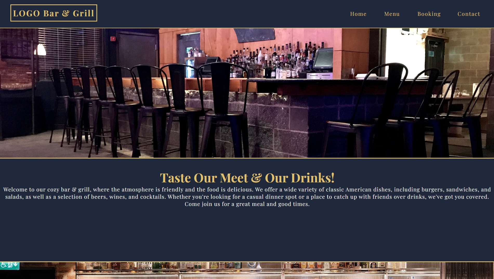
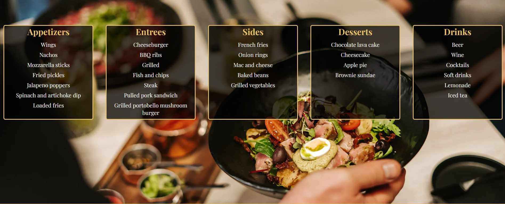
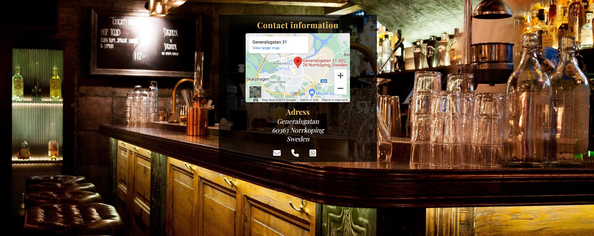
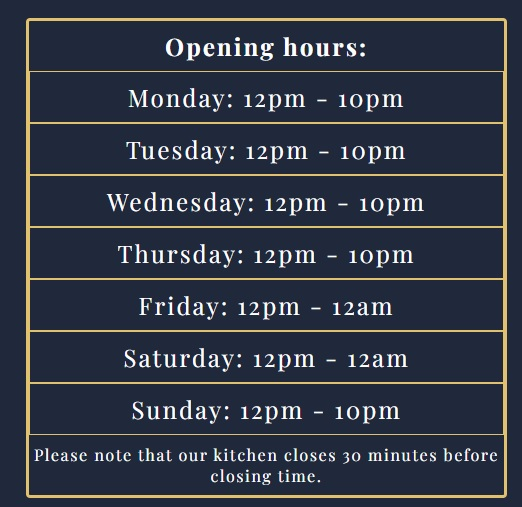
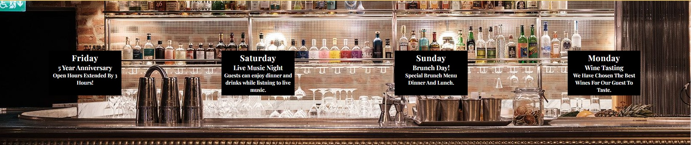
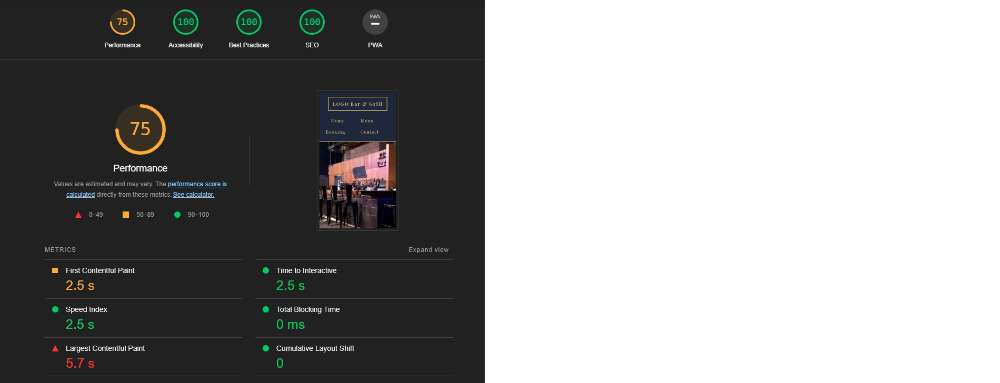

#  LOGO Bar & Grill
- 

## Purpose of the Project
For project 1 milestone, I have created a Restaurant & Bar website for a local bar and grill nearby where I live.

Note: The resturant's name and location is fiction.

[View the live project here.](https://oskarj1993.github.io/Project1/)

## User Stories
- As a guest, I want to be able to view the menu on the website.
- As a guest, I want to be able to make a reservation online.
- As a guest, I want to be able to view opening hours.
- As a guest, I want to be able to view the restaurant's contact information.
- As a guest, I want to be able to find where the restaurant's is located.
- As a guest, I want to be able to view events.

## Features

### Menu displayed on website.
- 

### Online reservation.

- 

### Opening hours and location information.

- 

- 

### Events.

- 

## Future Features
- Home delivery.
- Rating & review page.

## Typography and Color Scheme
- The website will feature a design with a color scheme of blue, black, and gold.
- The typography will be Playfair Display and with a backup of Sans-serif, the focus is readability.

## Technology
- HTML5
- CSS3
- Git (To push to my respiratory on Github)

## Wireframes

[Figma Design](https://www.figma.com/file/wayT9Z27AmAV2XAdUMhyq8/Untitled?node-id=1%3A38&t=IXN6iC1Ou8AhZM1w-1 "Link to Figma")

## Testing
- The website will undergo thorough testing to ensure it functions and responsiveness.

 ### Functionallity Test

| ID | Test Label | Test Action | Expected Outcome | Test Outcome |
|----|------------|--------------------------------|--------------|------------------
| 1 | Landing page / Welcome page | User enters site | Images, text, links work | PASS |
| 2 | Menu page | Navigate on menu page | Images, texts, links, icons work | PASS |
| 3 | Booking page | User books table validation | Booking a table on the booking form works | PASS |
| 4 | Contact page | Contact icons, google maps, icons, links | clickable icons, google maps and links working | PASS |
| 5 | Responsiveness | Tested on diffrent device sizes | Works on various diffrent screen sizes | PASS |

### Code Validation
- The code will be validated using the W3C Validator, W3C jigsaw CSS validator, lighthouse test and Am i responsive to validate there is no errors and site is responsive.

## W3C Markup validator
- Screenshots of results:
- 

## W3C JIGSAW CSS Validator
- Screenshots of results:

- 

## Am I Responsive
- Screenshots of results:

- 

## LightHouse test
- Screenshots of results:

- 

## Fixed Bugs
- When using my phone, the responsiveness did not work as expected. This was solved by adding a media querie for smaller screens.

## Supported Screens and Browsers
- The website was tested on the following browsers:

- Desktop: Google Chrome, Mozilla Firefox, Microsoft Edge.
- Mobile: Google Chrome, Safari.

## Deployment
The website will be deployed using the following methods:

### Via Github pages:

- Open GitHub repository and open the settings tab
- From settings navigate to pages tab
- Under branch, select the main branch through the dropdown menu
- Once selected and saved, the page will be refreshed (in case of nothing happening  wait for a couple muinites and refresh page manually)
- The refreshed page will show a detailed ribbon containing the website link and indicate a successful deployment.

- [LINK TO GITHUB PAGE.](https://oskarj1993.github.io/Project1/)
 
- 

## Credits
- [Am i Responsive](http://ami.responsivedesign.is) For validating responsiveness.

- [Google Fonts](https://fonts.googleapis.com/css2?family=Playfair+Display:wght@400;700&display=swap) Used on all pages.

- [Stackoverflow](https://stackoverflow.com/) On stackoverflow I could find answers for every problem I had.

- [Fontawsome](https://fontawesome.com/ For using their awsome fonts! 

