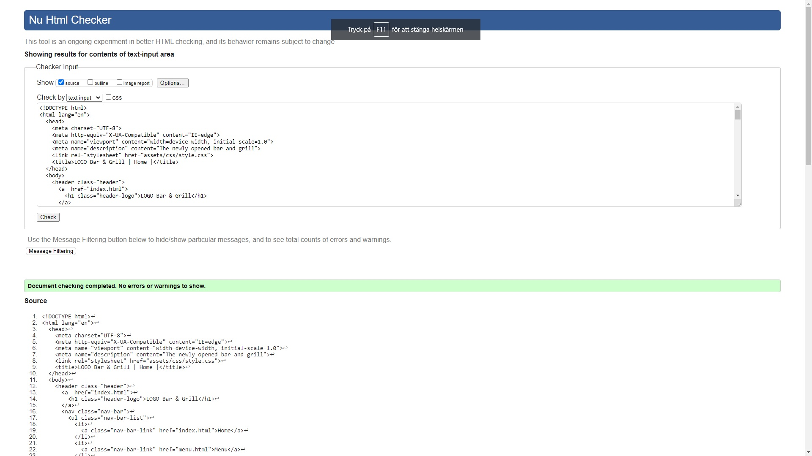
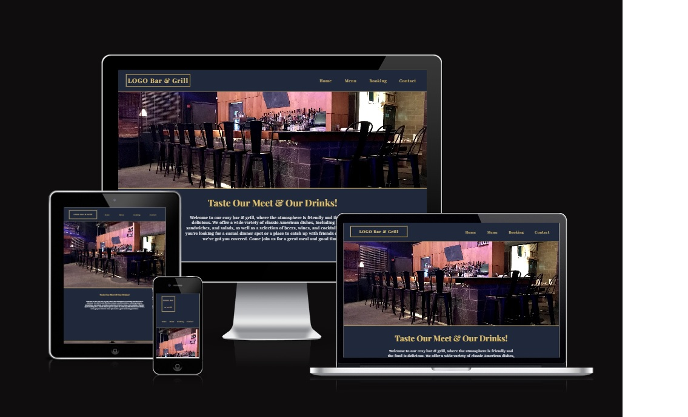
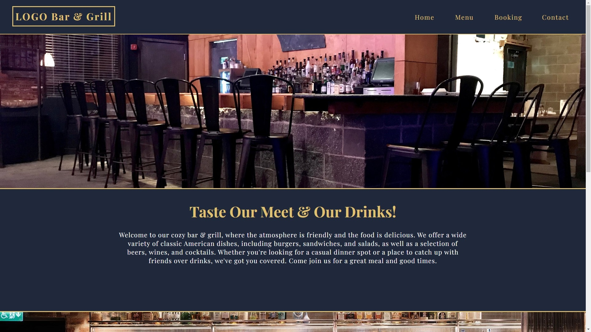

#  LOGO Bar & Grill

## Purpose of the Project
For project 1 milestone, I have created a Resturant & Bar website for a local bar and grill nearby where I live.

Note: The resturant's name and location is fiction.

[View the live project here.](https://oskarj1993.github.io/Project1/)

## User Stories
- As a guest, I want to be able to view the menu on the website.
- As a guest, I want to be able to make a reservation online.
- As a guest, I want to be able to view opening hours.
- As a guest, I want to be able to view the restaurant's contact information
- As a guest, I want to be able to find where the resturant is located.
- As a guest, I want to be able to view events.

## Features
- Menu displayed on website.
- Online reservation.
- Opening hours and location information.
- Events.

## Future Features
- Home delivery.

## Typography and Color Scheme
- The website will feature a design with a color scheme of blue, black, and gold.
- The typography will be Playfair Display and with a backup of Sans-serif, the focus is readability.

## Technology
- HTML5
- CSS3
- Git (To push to my respiratory on Github)

## Wireframes

[Figma Design](https://www.figma.com/file/wayT9Z27AmAV2XAdUMhyq8/Untitled?node-id=1%3A38&t=IXN6iC1Ou8AhZM1w-1 "Link to Figma")

## Testing
- The website will undergo thorough testing to ensure it functions and responsiveness.

### Code Validation
- The code will be validated using the W3C Validator, W3C jigsaw CSS validator and Am i responsive to validate there is no errors and site is responsive.

- At the time of publishing, W3C CSS Validator did not work so I used wtools.io CSS validator.

## W3C Markup validator
- Screenshots of results:
- 

## Wtools CSS Validator
- Screenshots of results:

- 

## Am I Responsive
- Screenshots of results:

- 

## Fixed Bugs
- When using my phone, the responsiveness did not work as expected. This was solved by adding a media querie for smaller screens.

## Supported Screens and Browsers
- The website was tested on the following browsers:

- Desktop: Google Chrome, Mozilla Firefox, Microsoft Edge.
- Mobile: Google Chrome, Safari.

## Deployment
The website will be deployed using the following methods:

- Via Github pages:
- [LINK TO GITHUB PAGE.](https://oskarj1993.github.io/Project1/)
 
- 

## Credits
- [Am i Responsive](http://ami.responsivedesign.is) For validating responsiveness.

- [Google Fonts](https://fonts.googleapis.com/css2?family=Playfair+Display:wght@400;700&display=swap) Used on all pages.

- [Stackoverflow](https://stackoverflow.com/) On stackoverflow I could find answers for every problem I had.

